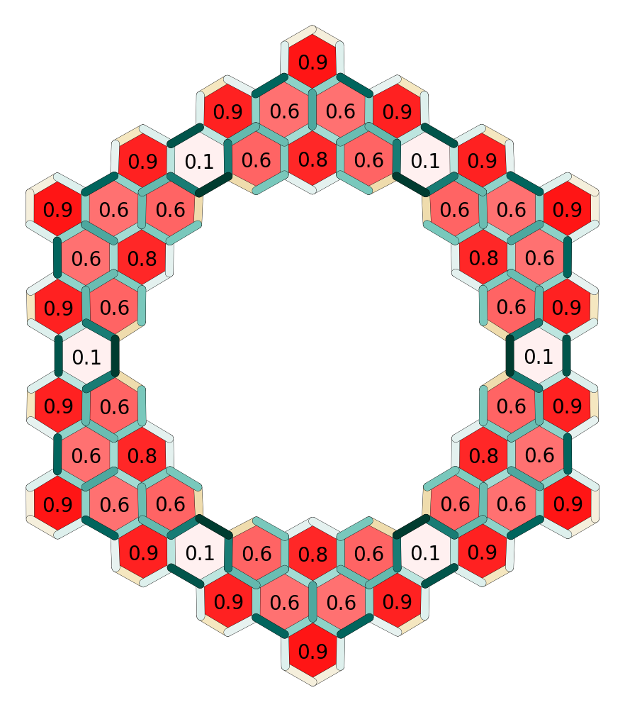
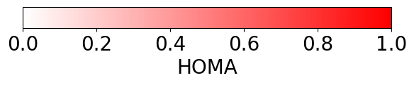
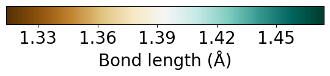

# Harmonic Oscillator Model of Aromaticity (HOMA)

This repository contains the code perform the HOMA analysis.
Reference bond lengths were calculated with butadiene and benzene, both at the B3LYP/6-311G** level of theory (input files included).

The code contains the example application on a large coronoid molecule:

  

  

  

For details and in-depth analysis, see the [related publication](https://doi.org/10.1021/jacs.0c05268):

    Large-Cavity Coronoids with Different Inner and Outer Edge Structures
    Di Giovannantonio, M., Yao, X., Eimre, K., Urgel, J.I., Ruffieux, P., Pignedoli, C.A., Müllen, K., Fasel, R., Narita, A.
    J. Am. Chem. Soc. 142, 12046–12050. (2020) https://doi.org/10.1021/jacs.0c05268
